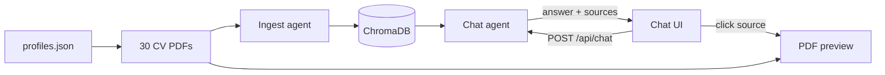

# AI Resume Screener

RAG chat prototype for screening a collection of PDF résumés.

Ask natural-language questions about ~30 demo CVs → the backend retrieves grounded chunks from ChromaDB → Gemini answers with **source citations**. Click a source to open the CV PDF in a side panel.

Local-only; no deployment required.

## Stack

| Layer | Technology |
|-------|------------|
| Frontend | Vite 6 · React 19 · TypeScript · Tailwind CSS v4 · shadcn/ui |
| Backend | FastAPI · LangGraph · Python 3.11+ |
| LLM | Google Gemini (`gemini-flash-latest`, configurable) |
| Embeddings | Google `gemini-embedding-001` |
| Vector store | ChromaDB (local, persistent) |
| PDF extraction | pymupdf4llm |
| CV generation | Seed JSON · ReportLab · optional AI headshots |

## How it works

Full workflow diagram (Mermaid + ASCII): **[docs/ARCHITECTURE.md](docs/ARCHITECTURE.md)**.



```
profiles.json → generate_cvs.py → data/cvs/*.pdf
        ↓
ingest.py: extract → chunk → embed → ChromaDB
        ↓
Chat UI → retrieve (+ boosters) → validate → generate → cite
        ↓
Answer + sources → click → GET /api/cvs/{file}
```

**Grounding:** if retrieval scores are too low, the API returns an explicit “not enough evidence” message instead of inventing facts.

## Quick start

### Prerequisites

- Python 3.11+ (3.12 recommended)
- Node.js 18+ and [pnpm](https://pnpm.io)
- A [Google AI Studio](https://aistudio.google.com/apikey) API key

### 1. Backend

```bash
cd backend
python3 -m venv .venv
source .venv/bin/activate          # Windows: .venv\Scripts\activate
pip install -r requirements.txt
cp .env.example .env               # set GOOGLE_API_KEY=...
```

Index the committed PDFs (once; needs network + API quota):

```bash
# from repo root, with backend venv active
python scripts/ingest.py
```

Start the API:

```bash
cd backend
source .venv/bin/activate
uvicorn app.main:app --reload --port 8000
```

Check: `curl http://localhost:8000/health` → `{"status":"ok","indexReady":true}`

### 2. Frontend

```bash
cd frontend
pnpm install
pnpm dev
```

Open [http://localhost:5173](http://localhost:5173).

## Demo questions

Use English for best retrieval (CVs are mixed EN/ES):

| Question | What to look for |
|----------|------------------|
| `Who has experience with Python?` | Several candidates + source badges |
| `Which candidate graduated from UPC?` | Jane Doe, Ana Torres, Hugo Martín, Beatriz Navarro |
| `Summarize the profile of Jane Doe.` | Short grounded summary; sources for Jane only |

Then click a **source** badge → CV opens on the right (drag the edge to resize).

## Regenerating CVs (optional)

PDFs under `data/cvs/` are already committed for the demo.

```bash
# from repo root, backend venv active
python scripts/enrich_profiles.py          # expand seed text
python scripts/generate_cvs.py             # 30 PDFs; AI photos for 6 sample CVs
python scripts/generate_cvs.py --photos all
python scripts/ingest.py                   # rebuild Chroma index after PDF changes
```

## API surface

| Method | Path | Purpose |
|--------|------|---------|
| `GET` | `/health` | Liveness + `indexReady` |
| `POST` | `/api/chat` | `{ "question": "...", "history": [] }` → answer + sources + metrics |
| `POST` | `/api/reindex` | Rebuild vector index from `data/cvs/` |
| `GET` | `/api/cvs/{filename}` | Serve a CV PDF inline |

## Project layout

```
ai-resume-screener/
├── backend/app/
│   ├── agents/          # LangGraph: ingest_agent, chat_agent
│   ├── rag/             # chunker, store, retriever (boosters)
│   ├── api/routes/      # health, chat, reindex, cvs
│   ├── cv_renderer.py   # ReportLab PDF builder
│   └── photo_generator.py
├── frontend/src/        # Chat UI + CV preview panel
├── data/
│   ├── cvs/             # 30 demo PDFs + photos/ (committed)
│   ├── seed/            # profiles.json
│   └── chroma/          # vector index (gitignored)
├── scripts/             # generate_cvs, ingest, enrich_profiles
└── docs/                # ARCHITECTURE, DEVELOPMENT, VIDEO_SCRIPT
```

## Design highlights

- **Two LangGraph agents** — offline ingest vs runtime chat (clear separation).
- **Retrieval boosters** — name, skills, role, section intent, institution/acronym, PDF slug; adaptive scoring without blindly lowering the global threshold.
- **Source indication + PDF preview** — citations map to real chunks; click opens the résumé.
- **Invariant checks** — citations must come from retrieved evidence.

## Docs

- [Architecture](docs/ARCHITECTURE.md) — flows and data layout
- [Development](docs/DEVELOPMENT.md) — commit workflow and env vars
- [Video script](docs/VIDEO_SCRIPT.md) — Loom outline for the assessment demo

## Environment

Copy `backend/.env.example` → `backend/.env`. Important keys:

| Variable | Default | Purpose |
|----------|---------|---------|
| `GOOGLE_API_KEY` | — | Gemini chat + embeddings |
| `GEMINI_MODEL` | `gemini-flash-latest` | Chat model |
| `GEMINI_EMBEDDING_MODEL` | `gemini-embedding-001` | Embeddings |
| `RETRIEVAL_TOP_K` | `6` | Chunks returned |
| `RETRIEVAL_MIN_SCORE` | `0.65` | Grounding threshold |

Never commit `.env`. Free-tier Gemini quotas can return `429`; wait and retry or enable billing.

## License

Private — technical assessment project.
