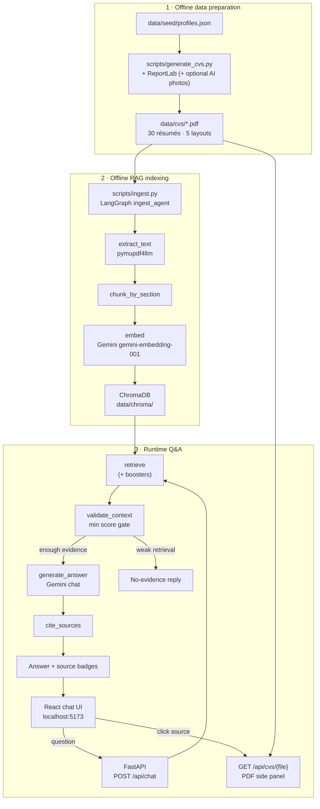

# Architecture

Overview of the AI Resume Screener end-to-end workflow.

## Overview diagram



### Same flow (ASCII)

```
┌─────────────────────────────────────────────────────────────────┐
│  OFFLINE                                                         │
│  profiles.json → generate_cvs.py → 30 PDFs                       │
│       ↓                                                          │
│  ingest.py: extract → chunk → embed → ChromaDB                   │
└─────────────────────────────────────────────────────────────────┘
                              │
                              ▼
┌─────────────────────────────────────────────────────────────────┐
│  RUNTIME                                                         │
│  Chat UI ──POST /api/chat──► retrieve (+ boosters)               │
│                               → validate_context                 │
│                               → generate_answer (Gemini)         │
│                               → cite_sources                     │
│  UI shows answer + sources                                       │
│  Click source ──GET /api/cvs/{file}──► PDF preview panel         │
└─────────────────────────────────────────────────────────────────┘
```

## LangGraph agents

| Agent | When | Nodes |
|-------|------|-------|
| **ingest** | `scripts/ingest.py` or `POST /api/reindex` | extract → chunk → embed/store → verify |
| **chat** | each user question | retrieve → validate → generate → cite |

CV PDFs are **not** generated inside LangGraph — only offline from seed JSON.

## Backend layout

```
backend/app/
├── main.py
├── config.py / llm.py / invariants.py / metrics.py
├── cv_renderer.py / photo_generator.py / extractors.py
├── schemas/          # chat, cv, rag
├── api/routes/       # health, chat, reindex, cvs
├── agents/           # ingest_agent, chat_agent
└── rag/              # chunker, store, retriever
```

## API

| Method | Path | Description |
|--------|------|-------------|
| `GET` | `/health` | Liveness + `indexReady` |
| `POST` | `/api/chat` | Question → grounded answer + sources + metrics |
| `POST` | `/api/reindex` | Rebuild Chroma index from `data/cvs/` |
| `GET` | `/api/cvs/{filename}` | Serve CV PDF for the side panel |

## Key decisions

| Decision | Why |
|----------|-----|
| Seed JSON + ReportLab | Fast, reproducible demo CVs; RAG is the core deliverable |
| Two LangGraph agents | Clear split: index offline vs answer online |
| `validate_context` | Blocks low-score retrieval → fewer hallucinations |
| Retrieval boosters | Names, skills, roles, sections, institutions (EN/ES cues) without dumping the global threshold |
| ChromaDB local | Zero infra; cosine space so `score = 1 − distance` aligns with `RETRIEVAL_MIN_SCORE` |
| Vite + React | SPA chat; no SSR needed |
| Quota errors → HTTP 429 | Free-tier Gemini limits surface as a clear UI message |

## Data layout

- `data/seed/profiles.json` — candidate profiles
- `data/cvs/*.pdf` — 30 generated résumés (committed)
- `data/cvs/photos/` — AI headshots for sample CVs
- `data/cvs/manifest.json` — generation metadata
- `data/chroma/` — vector index (gitignored)

## Demo questions

- Who has experience with Python?
- Which candidate graduated from UPC?
- Summarize the profile of Jane Doe.
